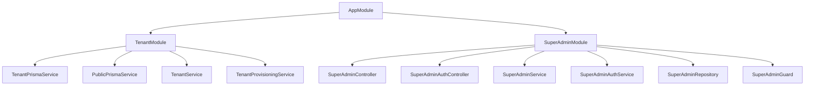
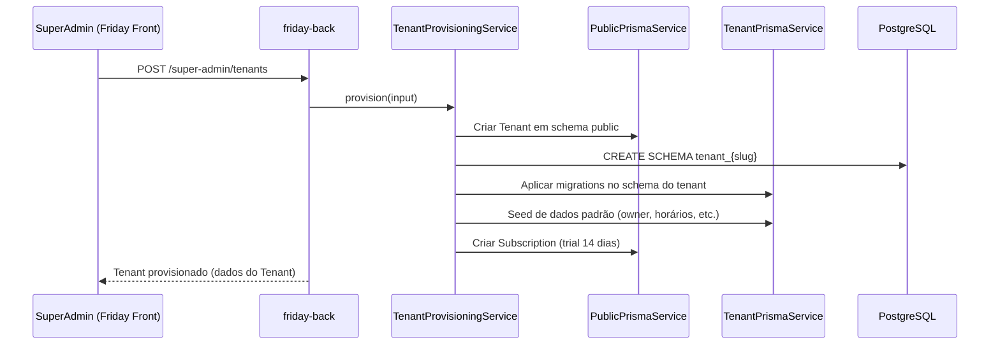

## Visão geral

O `friday-back` é uma API NestJS responsável pelo painel administrativo da FCTECH (SuperAdmin).  
Ele consome o mesmo banco PostgreSQL multi‑tenant do `barbershop-back`, utilizando:

- **`public.prisma`**: modelos globais (`Tenant`, `Plan`, `Subscription`, `SuperAdmin`).
- **`schema.prisma`**: modelos por tenant (usuários, estabelecimentos, agendamentos, etc.).
- **Módulos principais**:
  - `TenantModule`: serviços de multi‑tenant e multi‑schema.
  - `SuperAdminModule`: rotas de administração (`/super-admin/**`).

## Arquitetura de alto nível

Fluxo básico entre frontend Friday, backend e banco de dados:

```mermaid
flowchart LR
  AdminUser[Admin (Friday Front)] -->|HTTP| FridayFront[next.js /admin*]
  FridayFront -->|REST JSON| FridayBack[NestJS friday-back]
  FridayBack --> PublicPrisma[PublicPrismaService]
  FridayBack --> TenantPrisma[TenantPrismaService]
  PublicPrisma --> Postgres[(PostgreSQL\nschema public)]
  TenantPrisma --> Postgres
```

- **`PublicPrismaService`**: client Prisma configurado com `public.prisma`, acessando apenas o schema `public`.
- **`TenantPrismaService`**: gerencia conexões por schema (`tenant_{slug}`) usando `schema.prisma`.

## Arquitetura de módulos NestJS



- **`AppModule`**: raiz da aplicação, carrega `ConfigModule.forRoot`, `TenantModule` (global) e `SuperAdminModule`.
- **`TenantModule`** (global): centraliza tudo que é multi‑tenant / multi‑schema.
- **`SuperAdminModule`**: expõe as rotas `/super-admin/**` e encapsula autenticação, autorização e orquestração de casos de uso.

## Multi‑tenant e provisionamento de tenants

### Modelagem no schema `public`

Principais entidades em `public.prisma`:

- `Tenant`:
  - `id`, `name`, `slug`, `schemaName`
  - `status` (`ACTIVE`, `TRIAL`, `SUSPENDED`, `CANCELLED`)
  - relação com `Plan` e `Subscription`
- `Plan`:
  - enum `PlanType` (`TRIAL`, `BASIC`, `PROFESSIONAL`, `ENTERPRISE`)
  - limites (`maxEstablishments`, `maxProfessionals`, `maxAppointments`)
  - `features` (`Json`) para toggles como WhatsApp, Stripe, analytics etc.
- `Subscription`:
  - datas (`startDate`, `trialEndsAt`, `endDate`)
  - `isActive`, `stripeSubId`

### Fluxo de criação de tenant

Quando o SuperAdmin cria um tenant (`POST /super-admin/tenants`):



Pontos importantes:

- `TenantProvisioningService` garante:
  - criação do schema físico no banco;
  - aplicação das migrations do `schema.prisma` para o novo schema;
  - seeding de dados iniciais (owner, horários, etc.);
  - criação de `Subscription` em modo trial.
- Em caso de erro durante o provisionamento:
  - o tenant é removido do schema `public`;
  - o schema físico pode ser limpo dependendo da etapa em que falhou.

## Autenticação e autorização

### SuperAdmin

- Autenticação JWT com `JwtModule` configurado via `JWT_SECRET`.
- Controllers:
  - `POST /super-admin/auth/login`
- `SuperAdminGuard`:
  - extrai o token do header `Authorization: Bearer <token>`;
  - valida assinatura e expiração;
  - injeta o contexto do super admin no request.

### Comunicação com o frontend

- CORS configurado em `main.ts`:
  - `FRONTEND_URL` pode ser múltiplas origens separadas por vírgula;
  - habilita `credentials`, métodos HTTP básicos e headers `Content-Type` / `Authorization`.

## Rotas HTTP principais

Todas as rotas abaixo estão sob o prefixo `/super-admin` e protegidas por `SuperAdminGuard` (exceto as de auth).

### Autenticação

- `POST /super-admin/auth/login`
  - **Body**: `{ email, password }`
  - **Resposta**: `{ token, user }`
  - **Uso**: login do SuperAdmin. O token é guardado no `localStorage` do Friday Front.

### Dashboard

- `GET /super-admin/dashboard`
  - **Descrição**: consolida métricas globais (total de tenants, ativos, em trial, receita agregada, etc.).
  - **Uso**: cards principais do dashboard em `/admin`.

### Tenants

- `GET /super-admin/tenants`
  - **Query**: `page`, `limit`, `status`, `search`, `sortBy`, `sortOrder`
  - **Descrição**: lista paginada de tenants com plano e assinatura.
- `POST /super-admin/tenants`
  - **Body**: `CreateTenantDto`
  - **Descrição**: provisiona um novo tenant (inclui schema, seed e subscription).
- `GET /super-admin/tenants/:id`
  - Detalhes do tenant (plano, assinatura, métricas agregadas).
- `PATCH /super-admin/tenants/:id`
  - Atualiza dados cadastrais do tenant.
- `PATCH /super-admin/tenants/:id/suspend`
  - Marca tenant como `SUSPENDED` e interrompe uso da plataforma.
- `PATCH /super-admin/tenants/:id/activate`
  - Reativa tenant para `ACTIVE`.
- `DELETE /super-admin/tenants/:id`
  - Marca tenant como `CANCELLED` (soft delete lógico).
- `GET /super-admin/tenants/:id/metrics`
  - Retorna métricas de uso (agendamentos, faturamento, usuários ativos, etc.).
- `POST /super-admin/tenants/:id/reset-owner-password`
  - Gera e aplica um novo password para o owner do tenant.

### Usuários de tenant

Prefixo comum: `/super-admin/tenants/:id/users`

- `GET /super-admin/tenants/:id/users`
- `GET /super-admin/tenants/:id/users/:userId`
- `POST /super-admin/tenants/:id/users`
- `PATCH /super-admin/tenants/:id/users/:userId`
- `DELETE /super-admin/tenants/:id/users/:userId`

Objetivo:

- Gerenciar usuários de um tenant (criação, edição, desativação).

### Estabelecimentos, profissionais, agendamentos e receita

Prefixos:

- `GET /super-admin/tenants/:id/establishments`
- `GET /super-admin/tenants/:id/professionals`
- `GET /super-admin/tenants/:id/appointments`
- `GET /super-admin/tenants/:id/revenue`

Funções:

- listar estabelecimentos;
- listar profissionais;
- listar agendamentos com filtros (datas, status, etc.);
- retornar agregados de receita por período.

### Planos

Prefixo: `/super-admin/plans`

- `GET /super-admin/plans`
  - Lista planos disponíveis.
- `POST /super-admin/plans`
  - Cria novo plano.
- `PATCH /super-admin/plans/:id`
  - Atualiza um plano existente (nome, limites, `features`, etc.).

## Convenções importantes

- **Porta padrão**: `3002` (pode ser sobrescrita via `PORT`).
- **Env obrigatórios**:
  - `DATABASE_URL`
  - `JWT_SECRET`
  - `FRONTEND_URL` (origens permitidas do Friday Front).
- **Seeds**:
  - `npm run seed` popula:
    - `SuperAdmin` padrão;
    - planos iniciais (`TRIAL`, `BASIC`, `PROFESSIONAL`, `ENTERPRISE`).

